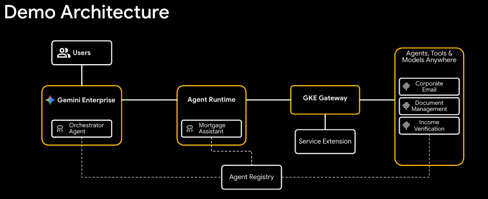

# Securing Cross-Cloud Agentic Enterprise Deployments

This repository contains the supporting code for the
[Securing Cross-Cloud Agentic Enterprise Deployments](https://codelabs.developers.google.com/next26/aiinfra-learning-pod/screen1-securing-cross-cloud-agentic)
codelab.

In this codelab, you deploy a multi-agent system securely using the Agent
Development Kit (ADK) and Agent Engine. You learn how an AI agent initiated by a
user in Gemini Enterprise securely navigates Google Cloud, other public clouds,
and on-premise infrastructure, relying on Agent Gateway to create order from
agentic sprawl.

## What you'll build

- An ADK mortgage assistant agent deployed to Agent Engine with OpenTelemetry
  instrumentation
- Backend MCP servers on Google Kubernetes Engine (GKE) behind an internal
  Gateway
- Private Service Connect (PSC) connectivity between Agent Engine and your VPC
- Agent Gateway for governed agent egress with DLP redaction and MCP
  authorization
- Model Armor guardrails for prompt and response screening
- (Optional) Apigee MCP Discovery Proxy to transcode REST APIs into MCP tools

## Architecture


## Repository structure

```
src/
├── dlp-ext-proc/              # Go — Envoy ext_proc for PII redaction via Cloud DLP
├── corporate-email/           # Python — MCP corporate email service
├── income-verification-api/   # Python — FastAPI mock income verification + MCP
├── legacy-dms/                # Python — MCP legacy document management service
└── mortgage-agent/            # Python — ADK agent for mortgage assistance

terraform/
├── main.tf                    # Root configuration
└── modules/                   # Modular infrastructure
    ├── foundation/            #   Project services and APIs
    ├── networking/            #   VPC, subnets, firewall, PSC
    ├── dns/                   #   Cloud DNS zones and records
    ├── certificates/          #   TLS certificate management
    ├── gke-cluster/           #   GKE cluster and node pools
    ├── gke-workload-identity/ #   Workload Identity Federation bindings
    ├── dlp-ext-proc/          #   DLP ext_proc Cloud Run deployment
    ├── model-armor/           #   Model Armor templates and policies
    ├── agent-engine/          #   Vertex AI Agent Engine configuration
    └── apigee/                #   Apigee API management

k8s/                           # Kustomize manifests per service
├── gateway-internal/          #   GKE Gateway, HTTPRoutes, service extensions
├── corporate-email/
├── dlp-ext-proc/
├── income-verification-api/
└── legacy-dms/
```

## Prerequisites

- A Google Cloud project with billing enabled
- Terraform >= 1.12.2
- Google Cloud SDK (`gcloud`)
- Go
- Python 3.12+ with [`uv`](https://docs.astral.sh/uv/)
- [Skaffold](https://skaffold.dev/)
- `kubectl`

## Quick start

Follow the step-by-step instructions in the
[codelab]([https://goo.gle/Infra1-Learn26?r=qr](https://codelabs.developers.google.com/next26/aiinfra-learning-pod/screen1-securing-cross-cloud-agentic). A summary of the
key steps:

```bash
# 1. Deploy infrastructure
cd terraform
cp example.tfvars terraform.tfvars   # edit with your project values
terraform init -backend-config=backend.conf
terraform apply

# 2. Connect to GKE
gcloud container clusters get-credentials gateway-cluster \
    --region=us-central1 --project=$PROJECT_ID

# 3. Generate K8s manifests from templates
cp k8s/config.env.example k8s/config.env   # edit with your values
bash k8s/generate.sh

# 4. Build and deploy services
envsubst '${PROJECT_ID}' < skaffold.yaml.tmpl > skaffold.yaml
skaffold run

# 5. Deploy Gateway configuration
kubectl apply -k k8s/gateway-internal/
```

### Deploy the mortgage agent to Agent Engine

Export the Terraform outputs needed for agent deployment:

```bash
export VPC_NAME=$(cd terraform && terraform output -raw vpc_name)
export PSC_ATTACHMENT=$(cd terraform && terraform output -raw psc_interface_network_attachment_id)
export DNS_PEERING_DOMAIN=$(cd terraform && terraform output -raw psc_interface_dns_peering_domain)
```

Install dependencies and deploy the agent:

```bash
cd src/mortgage-agent
uv sync

uv run python deploy_agent.py \
    --project=${PROJECT_ID} \
    --dms-mcp-url=https://dms.${DNS_PEERING_DOMAIN%%.}/mcp \
    --income-verification-url=https://income-verification.${DNS_PEERING_DOMAIN%%.} \
    --email-mcp-url=https://email.${DNS_PEERING_DOMAIN%%.}/mcp \
    --network-attachment=projects/${PROJECT_ID}/regions/${REGION}/networkAttachments/${PSC_ATTACHMENT} \
    --dns-peering-domain=${DNS_PEERING_DOMAIN} \
    --dns-peering-target-project=${PROJECT_ID} \
    --dns-peering-target-network=${VPC_NAME} \
    --enable-agent-identity \
    --ge-deploy \
    --app-id=${APP_ID} \
    --oauth-client-id=${OAUTH_CLIENT_ID} \
    --agent-name=mortgage-agent
```

The `--ge-deploy` flag registers the agent in Gemini Enterprise after deploying
to Agent Engine. This requires an OAuth client ID and secret — see the
[codelab](https://codelabs.developers.google.com/PLACEHOLDER) for setup
instructions.

### Connect via Gemini Enterprise

1. In the Google Cloud console, navigate to the **Gemini Enterprise** page.
2. Select the Gemini Enterprise App where the agent is registered.
3. Open the URL shown in the "Your Gemini Enterprise webapp is ready" section.
4. Select the **Agent** tab from the left menu to open the
   [Agent Gallery](https://cloud.google.com/gemini/enterprise/docs/agent-gallery).
5. Select **Mortgage Assistant Agent** and start chatting.

Try the following prompt to test the end-to-end flow:

```
I'm reviewing the Rivera family's $700K loan. Can you summarize their 2024 and
2025 tax returns and verify if their total household income meets our 2026
debt-to-income requirements?
```

The agent will retrieve documents from the DMS, verify income, and return a
summary with PII redacted by the DLP service extension. Check **Cloud Trace** in
the console to inspect the full request flow from Gemini Enterprise through Agent
Gateway to the backend MCP servers.

## Contributing

See [docs/CONTRIBUTING.md](docs/CONTRIBUTING.md) for contribution guidelines.

## License

[Apache License 2.0](LICENSE)
