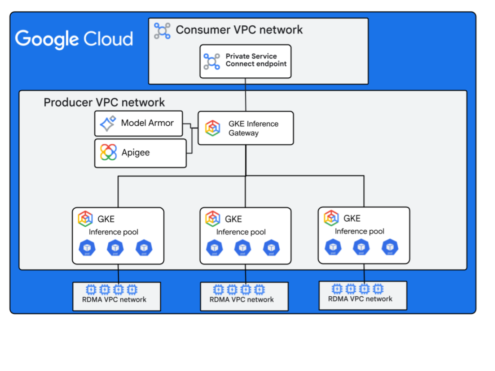
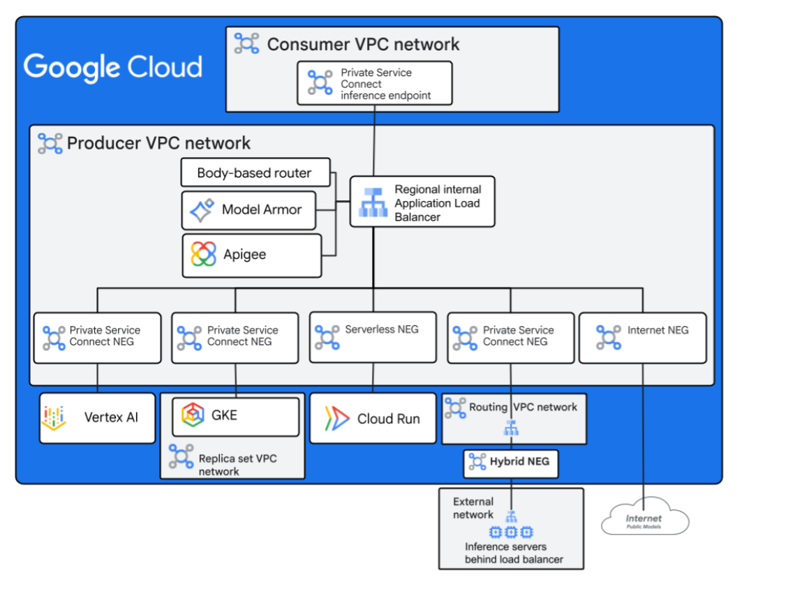

# Networking for AI Inference Model Serving

This repository provides reference implementations for deploying unified
AI inference endpoints on Google Cloud. Two gateway architectures are
supported, each optimized for different operational models. Both place AI
models behind a regional internal Application Load Balancer with
OpenAI-compatible routing.

## Reference Architectures
- [Architecture 1: GKE Inference Gateway](https://docs.cloud.google.com/architecture/networking-for-ai-inference-gke-ra)
- [Architecture 2: Self-Managed Gateway](https://docs.cloud.google.com/architecture/networking-for-ai-inference-ra)

## Documentation

| Guide | Description |
|---|---|
| [DNS Setup](docs/dns-setup.md) | Create a Cloud DNS managed zone and configure NS delegation before deploying |
| [Manual Deployment: GKE Gateway](docs/manual-deployment-gke-gateway.md) | Step-by-step deployment of the GKE Inference Gateway (Terraform + Kubernetes) |
| [Manual Deployment: Self-Managed Gateway](docs/manual-deployment-self-managed-gateway.md) | Step-by-step deployment of the Self-Managed Gateway with BBR ext\_proc |
| [Routing Examples](docs/routing_examples.md) | Configuration patterns for model-based, header-based, and A/B routing |
| [Reference Architecture: GKE Only](reference_docs/RA_Networking_for_AI_inference_model_serving_GKE_Only.md) | Full reference architecture for the GKE Inference Gateway |
| [Reference Architecture: All Backends](reference_docs/RA_Networking_for_AI_inference_model_serving_all_backends.md) | Full reference architecture for the Self-Managed multi-backend Gateway |

## Architecture 1: GKE Inference Gateway



The GKE Inference Gateway uses the Kubernetes Gateway API with
[GKE Inference Extensions](https://cloud.google.com/kubernetes-engine/docs/concepts/about-inference-extensions)
to route requests. Routing, scaling, and replica selection are managed
natively within GKE using `InferencePool` and `HTTPRoute` custom resources.

This architecture is best suited for teams that manage all of their models
on GKE and want Kubernetes-native traffic management.

```text
Clients
  │
  ▼
Regional Internal Application Load Balancer (gke-l7-rilb)
  │
  ├─ HTTPRoute (path-based: /v1/, /cache/, /security/)
  ├─ Model Armor GCPTrafficExtension      (optional)
  └─ Apigee Semantic Cache Extension       (optional)
  │
  ▼
InferencePool
  │
  └─ Endpoint Picker (EPP)
     ├─ Queue-depth scoring
     ├─ KV-cache utilization
     └─ Prefix-cache awareness
  │
  ▼
vLLM Pods on GKE (GPU node pools)
```

**How routing works:** The GKE Gateway controller provisions a regional
internal Application Load Balancer from the Kubernetes `Gateway` resource.
`HTTPRoute` resources define path-based routing rules that direct traffic to
`InferencePool` backends. The Endpoint Picker sidecar selects the optimal
replica based on real-time GPU metrics.

**Supported backends:** GKE-hosted models via `InferencePool`.

**Optional features (GKE mode):**

| Feature | Integration |
|---|---|
| Custom metrics | Stackdriver adapter enables HPA scaling on vLLM metrics (`num_requests_waiting`, `kv_cache_usage_perc`) |
| Model Armor | Deployed as a `GCPTrafficExtension` filtering requests on the `/security/` path |
| Semantic cache | Apigee-based `GCPTrafficExtension` on the `/cache/` path with Vertex AI Vector Search |
| Unified extension | Combines Model Armor and semantic cache into a single extension chain |

**Gateway hostname:** `gateway.internal.<your-domain>`

For full deployment instructions, see [Manual Deployment: GKE Gateway](docs/manual-deployment-gke-gateway.md).

---

## Architecture 2: Self-Managed Inference Gateway



The Self-Managed Inference Gateway uses a Terraform-managed regional internal
Application Load Balancer with body-based routing. A lightweight gRPC service
(the Body-Based Router) runs on Cloud Run and implements the Envoy
[ext\_proc](https://www.envoyproxy.io/docs/envoy/latest/configuration/http/http_filters/ext_proc_filter)
protocol to extract the `model` field from the JSON request body and inject a
routing header.

This architecture is best suited for teams that serve models across multiple
backends (GKE, Vertex AI, Cloud Run, on-premises) and need fine-grained
control over routing logic.

```text
Clients
  │
  ▼
Regional Internal Application Load Balancer (Terraform-managed)
  │
  └─ LbRouteExtension ──► BBR ext_proc (Cloud Run)
     │                        │
     │                        ├─ Parses JSON body
     │                        ├─ Extracts "model" field
     │                        └─ Injects X-Gateway-Model-Name header
     │
     ▼
  URL Map (header + path matching)
     │
     ├─ model_prefix: "google/gemini*"  ──► Vertex AI (Internet NEG)
     ├─ model_prefix: "google/gemma*"   ──► GKE (Zonal NEGs)
     ├─ path: "/security/"              ──► Model Armor + GKE
     └─ header: X-Backend-Type          ──► Backend override (priority 1)
     │
     ▼
Backend Services
  ├─ GKE vLLM Pods    (Zonal NEGs on GPU node pools)
  ├─ Vertex AI         (Internet NEG → aiplatform.googleapis.com)
  ├─ Cloud Run         (Serverless NEG)
  └─ On-premises       (Hybrid connectivity NEG)
```

**How routing works:** Every request passes through the BBR ext\_proc
service, which reads the `model` field from the OpenAI-compatible JSON body
and sets the `X-Gateway-Model-Name` header. The load balancer's URL map
matches on this header (and optionally the URL path) to select the correct
backend service. An `X-Backend-Type` header can override routing entirely.

**Supported backends:** GKE, Vertex AI, Cloud Run, on-premises, and any
internet-reachable endpoint.

**Optional features (DIY mode):**

| Feature | Integration |
|---|---|
| Model Armor | Configured in Terraform as a path rule (`/security/`) on the load balancer |

> Semantic cache and custom metrics are available only in the GKE gateway
> mode.

**Gateway hostname:** `diy.internal.<your-domain>`

For full deployment instructions, see [Manual Deployment: Self-Managed Gateway](docs/manual-deployment-self-managed-gateway.md).

---

## Architecture comparison

| Aspect | GKE Inference Gateway | Self-Managed Gateway |
|---|---|---|
| Load balancer | GKE-managed (`gke-l7-rilb`) | Terraform-managed regional internal ALB |
| Routing mechanism | Kubernetes `HTTPRoute` | URL Map + BBR ext\_proc header injection |
| Replica selection | Endpoint Picker (queue-depth, KV-cache) | Load balancer algorithm (round-robin, utilization) |
| Backend types | GKE `InferencePool` only | GKE, Vertex AI, Cloud Run, hybrid, internet |
| Custom metrics scaling | Yes | No |
| Semantic cache | Yes (Apigee + Vertex AI) | No |
| Model Armor | Yes (`GCPTrafficExtension`) | Yes (Terraform path rule) |
| Additional tooling | `kubectl`, `helm`, `kustomize` | `docker` (to build BBR image) |
| Deployment phases | Terraform + K8s manifests | Terraform phase 1, K8s deploy, NEG discovery, Terraform phase 2 |

## Getting started

### Prerequisites

Before deploying either gateway architecture, ensure you have the following.

**Google Cloud resources:**

- A Google Cloud project with billing enabled.
- An existing Cloud DNS managed zone for your domain. If you do not have one,
  follow the [DNS Setup guide](docs/dns-setup.md) to create a zone and
  configure NS delegation from your registrar.
- Sufficient GPU quota in the target region (the deployment requests H100 or
  A100 GPUs by default).
- IAM permissions to create GKE clusters, VPCs, load balancers, DNS records,
  and related resources.

**CLI tools:**

| Tool | Required for | Install link |
|---|---|---|
| `gcloud` | Both | [Google Cloud SDK](https://cloud.google.com/sdk/docs/install) |
| `terraform` >= 1.7 | Both | [Terraform](https://developer.hashicorp.com/terraform/install) |
| `kubectl` | Both | [kubectl](https://kubernetes.io/docs/tasks/tools/) |
| `helm` | GKE (semantic cache) | [Helm](https://helm.sh/docs/intro/install/) |
| `kustomize` | Both | [Kustomize](https://kubectl.docs.kubernetes.io/installation/kustomize/) |
| `envsubst` | Both | Part of GNU `gettext` |
| `docker` | DIY only | [Docker](https://docs.docker.com/get-docker/) |

**Optional:**

- A [Hugging Face API token](https://huggingface.co/settings/tokens) if you
  need to access gated models.

### 1. Clone the repository

```bash
git clone https://github.com/GoogleCloudPlatform/architecture-center-samples.git
cd architecture-center-samples/networking-for-ai-inference
```

### 2. Set up DNS

If you do not already have a Cloud DNS managed zone, follow the
[DNS Setup guide](docs/dns-setup.md). The guide covers:

- Creating a public managed zone in Google Cloud.
- Retrieving the assigned name servers.
- Configuring NS delegation at your domain registrar.
- Verifying propagation with `dig`.

### 3. Choose a deployment method

You can deploy using the automated script or follow the manual guides for
full control over each step.

**Automated deployment (recommended for first-time setup):**

```bash
export HF_TOKEN=YOUR_HF_TOKEN

# GKE Inference Gateway
./deploy.sh \
  --project YOUR_PROJECT_ID \
  --region us-east4 \
  --dns-zone YOUR_DNS_ZONE_NAME \
  --type gke \
  --models gemma-3-27b-it

# Self-Managed (DIY) Gateway
./deploy.sh \
  --project YOUR_PROJECT_ID \
  --region us-east4 \
  --dns-zone YOUR_DNS_ZONE_NAME \
  --type diy \
  --models gemma-3-27b-it
```

**Manual deployment:**

For step-by-step control, follow the manual deployment guides:

- [Manual Deployment: GKE Gateway](docs/manual-deployment-gke-gateway.md) --
  Covers Terraform variable rendering, API enablement, infrastructure
  provisioning, and Kubernetes resource deployment including CRDs,
  custom-metrics adapter, Gateway, and model workloads.
- [Manual Deployment: Self-Managed Gateway](docs/manual-deployment-self-managed-gateway.md) --
  Covers Terraform variable rendering, BBR Docker image build, infrastructure
  provisioning, Kubernetes model deployment, and NEG endpoint population.

### 4. Validate the deployment

Use the included test script from a pod inside the cluster:

```bash
# GKE Gateway
GATEWAY_HOST=gateway.internal.YOUR_DOMAIN ./test_endpoints.sh gke

# DIY Gateway
GATEWAY_HOST=diy.internal.YOUR_DOMAIN ./test_endpoints.sh diy
```

## Deployment options

| Flag | Description | Default |
|---|---|---|
| `-p, --project` | Google Cloud project ID | Auto-detected from `gcloud config` |
| `-r, --region` | Google Cloud region | `us-east4` |
| `-z, --dns-zone` | Cloud DNS managed zone name | _(required)_ |
| `-t, --type` | Gateway type: `gke` or `diy` | _(interactive prompt)_ |
| `-k, --hf-token` | Hugging Face API token (prefer `export HF_TOKEN=...` to avoid process visibility) | _(optional)_ |
| `-m, --models` | Comma-separated list of models | `gemma-3-27b-it` |
| `-f, --features` | Comma-separated feature list | `custom-metrics` |
| `-s, --skip-infra` | Skip API enablement and Terraform | `false` |
| `--dry-run` | Render templates and validate only | `false` |

> **Security note:** Passing secrets as command-line arguments exposes them in
> process listings. Set `HF_TOKEN` as an environment variable instead of using
> `--hf-token` on the command line.

### Available features

Enable optional features with the `--features` flag:

| Feature | Description | GKE | DIY |
|---|---|---|---|
| `custom-metrics` | Stackdriver adapter for GPU-aware HPA autoscaling | Yes | No |
| `model-armor` | AI guardrails with PII detection, prompt injection filtering, and responsible AI filters | Yes | Yes |
| `semantic-cache` | Apigee-based semantic caching using Vertex AI Vector Search | Yes | No |
| `unified-extension` | Combined Model Armor and semantic cache as a single service extension | Yes | No |

> `semantic-cache` and `unified-extension` are mutually exclusive.

### Available models

The `k8s/models/` directory contains sample model configurations:

- `gemma-3-27b-it` -- Google Gemma 3 (27B parameters)
- `llama-3-8b` -- Meta Llama 3 (8B parameters)

## Extending the gateway

### Adding a new model

Both gateway architectures support adding new models. Each manual deployment
guide includes a dedicated section:

- **GKE Gateway:** See
  [Adding a new model](docs/manual-deployment-gke-gateway.md#adding-a-new-model)
  for creating model overlay directories with `InferencePool`, `HTTPRoute`,
  and kustomization resources.
- **Self-Managed Gateway:** See
  [Adding a new model](docs/manual-deployment-self-managed-gateway.md#adding-a-new-model)
  for adding Terraform backend services, routing rules, and Kubernetes
  overlays with NEG annotations.

### Adding new backends (Self-Managed Gateway)

The Self-Managed Gateway supports four backend types. See
[Adding new backends](docs/manual-deployment-self-managed-gateway.md#adding-new-backends)
for configuration details on each:

- **GKE NEG backends** -- Pre-created zonal NEGs adopted by the GKE NEG
  controller.
- **Internet FQDN backends** -- External APIs such as Vertex AI, OpenAI, or
  Anthropic.
- **Serverless NEG backends** -- Cloud Run or Cloud Functions services.
- **Existing NEG backends** -- Pre-existing NEGs managed outside this module.

### Routing configuration

The Self-Managed Gateway supports model-based, header-based, and path-based
routing rules with configurable priority. For detailed examples including
exact matching, prefix matching, cross-platform redundancy, A/B testing, and
URL rewriting for Vertex AI, see the
[Routing Examples guide](docs/routing_examples.md).

### Semantic cache: Terraform coverage gap

The `semantic-cache` and `unified-extension` features are only available for
the GKE Inference Gateway. Terraform provisions the underlying infrastructure
(Apigee organization, environment, instance, and Vertex AI Vector Search
index and endpoint), but the Apigee semantic cache proxy bundle is not
managed by Terraform. After Terraform completes, the proxy bundle must be
built and deployed manually via the Apigee REST API. See
[Step 10 of the GKE Gateway manual deployment guide](docs/manual-deployment-gke-gateway.md#step-10-deploy-semantic-cache-proxy-to-apigee-semantic-cache-only)
for the full procedure.

### Integrating into an existing setup

To integrate these gateway architectures into an existing Google Cloud
environment:

1. **Existing VPC:** Update the `terraform.tfvars` to reference your VPC and
   subnet names. The Terraform modules accept VPC configuration as input
   variables rather than creating a new VPC.
2. **Existing GKE cluster:** If you already have a GKE cluster with GPU node
   pools, skip the cluster creation module and point the Kubernetes
   deployments at your cluster. Ensure the cluster has the required node
   labels and compute classes.
3. **Existing DNS zone:** The DNS module uses a `data` source to look up an
   existing zone. Point the `dns_zone_name` variable to your zone. See the
   [DNS Setup guide](docs/dns-setup.md#integration-with-the-terraform-dns-module)
   for details.
4. **Existing Apigee organization:** If you already have Apigee provisioned,
   configure the `apigee_*` variables to reference your organization,
   environment, and instance. The semantic cache feature integrates with
   existing Apigee environments.

## Repository structure

```text
.
├── deploy.sh                        # Automated deployment pipeline
├── test_endpoints.sh                # Endpoint validation script
├── docs/                            # Deployment and configuration guides
│   ├── dns-setup.md                 # DNS zone creation and NS delegation
│   ├── manual-deployment-gke-gateway.md
│   ├── manual-deployment-self-managed-gateway.md
│   └── routing_examples.md          # Routing configuration patterns
├── reference_docs/                  # Reference architecture documents
├── src/
│   └── bbr-ext-proc-go/             # Body-Based Router (Envoy ext_proc gRPC server)
├── terraform/
│   ├── main.tf                      # Root Terraform orchestration
│   ├── variables.tf                 # Input variables
│   ├── outputs.tf                   # Output definitions
│   ├── gke-gateway.tfvars.tmpl      # GKE gateway config template
│   ├── diy-gateway.tfvars.tmpl      # DIY gateway config template
│   └── modules/
│       ├── foundation/              # API enablement, GPU quotas
│       ├── networking/              # VPC, subnets, Cloud NAT, static IPs
│       ├── gke-cluster/             # GKE Standard clusters with GPU node pools
│       ├── gke-node-service-account/# Dedicated node pool service account
│       ├── storage/                 # GCS, Secret Manager, Artifact Registry
│       ├── certificates/            # Certificate Manager (SSL/TLS)
│       ├── dns/                     # Cloud DNS zones and records
│       ├── model-armor/             # AI safety and guardrails
│       ├── apigee/                  # Apigee X organization
│       ├── apigee-semantic-proxy/   # Apigee semantic caching proxy
│       ├── semantic-cache/          # Vertex AI + Apigee integration
│       ├── vertex-ai-index/         # Vertex AI Vector Search index
│       ├── service-extension/       # Service Extension setup
│       └── self-managed-inference-gateway/  # Regional internal ALB
└── k8s/
    ├── base/                        # Namespace, compute classes
    ├── shared/                      # Shared secrets, compute classes
    ├── gateway/                     # Kubernetes Gateway resources
    ├── models/                      # Model deployment manifests
    │   ├── base/                    # Base model deployment (GKE gateway)
    │   ├── base-diy/                # Base model deployment (DIY gateway)
    │   ├── gemma-3-27b-it/          # Gemma 3 model overlay
    │   └── llama-3-8b/              # Llama 3 model overlay
    └── features/                    # Optional feature components
        ├── custom-metrics/          # GPU metrics adapter
        ├── model-armor/             # Model Armor integration
        ├── semantic-cache/          # Semantic cache extension
        ├── semantic-cache-infra/    # Apigee operator and Helm charts
        └── unified-extension/       # Combined extension
```

## Manual Terraform deployment

If you prefer to run Terraform directly instead of using `deploy.sh`, see the
manual deployment guides for detailed instructions:

- [GKE Gateway manual deployment](docs/manual-deployment-gke-gateway.md)
- [Self-Managed Gateway manual deployment](docs/manual-deployment-self-managed-gateway.md)

For a minimal Terraform-only workflow:

```bash
cd terraform

# Create a backend configuration
cat > backend.conf <<EOF
bucket = "YOUR_GCS_BUCKET"
prefix = "inference-gateway/terraform"
EOF

# Initialize
terraform init -backend-config=backend.conf

# Copy and edit a tfvars template
cp gke-gateway.tfvars.tmpl gke-gateway.tfvars
# Edit gke-gateway.tfvars with your project values

# Plan and apply
terraform plan -var-file=gke-gateway.tfvars
terraform apply -var-file=gke-gateway.tfvars
```

## Testing endpoints

The `test_endpoints.sh` script deploys a temporary `curl-test` pod inside the
cluster and validates each routing path.

**GKE Inference Gateway tests:**

1. Standard inference via `InferencePool` (`/v1/` path)
2. Semantic cache -- cache miss followed by cache hit (`/cache/` path)
3. Model Armor PII filtering (`/security/` path)

**Self-Managed Gateway tests:**

1. Body-based routing to GKE -- sends a request with a Gemma model name and
   verifies routing to the GKE backend
2. Body-based routing to Vertex AI -- sends a request with a Gemini model
   name and verifies routing to the Vertex AI backend
3. Model Armor PII filtering -- sends a request containing PII to the
   `/security/` path
4. Backend override -- sends a request with the `X-Backend-Type` header to
   force routing to a specific backend regardless of model name

## Clean up

To remove all deployed resources:

```bash
# Delete Kubernetes resources
kubectl delete -k k8s/

# Destroy Terraform infrastructure
cd terraform
terraform destroy -var-file=YOUR_TFVARS_FILE
```

## License

Apache 2.0. See [LICENSE](../LICENSE) for details.
